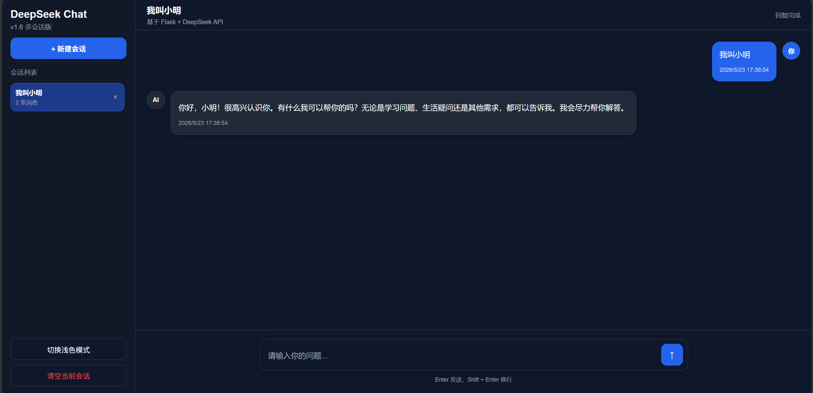

# DeepSeek Flask Chat

这是一个基于 Flask 和 DeepSeek API 的 AI 聊天网页项目。

本项目实现了一个简单的网页聊天助手：用户在网页输入问题，后端通过 Flask 接收请求，并调用 DeepSeek API 返回 AI 回复。

## 功能

- Flask 后端服务
- DeepSeek API 调用
- 前端聊天页面
- 支持用户输入并返回 AI 回复
- 使用 `.env` 文件保护 API Key
- 使用 `requirements.txt` 管理依赖

## 项目结构

```text
AI_PROJECT/
├── app.py
├── .env
├── .gitignore
├── requirements.txt
├── README.md
├── templates/
│   └── index.html
├── tests/
│   ├── test_deepseek.py
│   └── test_httpx.py
└── venv/
```

## 环境要求

- Python 3.10+
- VSCode
- DeepSeek API Key

## 安装与运行

### 1. 创建虚拟环境

```bash
python -m venv venv
```

### 2. 激活虚拟环境

Windows PowerShell：

```bash
.\venv\Scripts\Activate.ps1
```

如果是 CMD：

```bash
venv\Scripts\activate
```

### 3. 安装依赖

```bash
pip install -r requirements.txt
```

### 4. 创建 `.env` 文件

在项目根目录下创建 `.env` 文件，并写入：

```env
DEEPSEEK_API_KEY=你的DeepSeek API Key
```

注意：不要把真实 API Key 上传到 GitHub。

### 5. 启动项目

```bash
python app.py
```

### 6. 浏览器访问

```text
http://127.0.0.1:5000
```

## `.gitignore` 内容

```gitignore
venv/
.env
__pycache__/
*.pyc
```
## 项目亮点

- 基于 Flask 搭建后端服务，完成聊天、历史记录、会话管理、文档上传等接口设计
- 使用 DeepSeek API 实现 AI 对话能力，并支持流式输出，回复体验接近 ChatGPT
- 使用 SQLite 保存聊天记录、会话数据和上传文档内容
- 支持多会话管理，可新建、切换、删除不同聊天会话
- 支持 Markdown 渲染和代码高亮，适合学习、编程问答场景
- 支持上传 txt / md 文档，并基于文档内容进行简易知识库问答
- 实现了基于关键词检索的简易 RAG，根据用户问题从知识库中匹配相关文档片段
- 使用 .env 和 .gitignore 管理敏感信息，避免 API Key、数据库和上传文件被提交到 GitHub
- 支持 Cloudflare Quick Tunnel 临时公网访问，方便项目演示

## 技术栈

- Python
- Flask
- HTML
- CSS
- JavaScript
- DeepSeek API
- httpx
- python-dotenv
## 项目预览



## 当前版本

### v2.0.3 基于关键词检索的简易 RAG 版

已完成：

- Flask 后端项目搭建
- DeepSeek API 接入
- 前端聊天页面
- 多轮对话记忆
- SQLite 聊天记录保存
- 多会话管理
- Markdown 渲染
- 代码高亮
- AI 回复流式输出
- 浅色 / 深色模式切换
- Cloudflare Quick Tunnel 临时公网访问
- 支持上传 `.txt` / `.md` 文档
- 支持文档列表展示与删除
- 支持根据上传文档内容进行知识库问答
- 支持基于用户问题检索相关文档片段
- 支持只将相关片段注入提示词，减少无关文档干扰
## 临时公网访问

本项目支持使用 Cloudflare Quick Tunnel 生成临时公网访问链接。

先启动 Flask 项目：

```bash
python app.py
